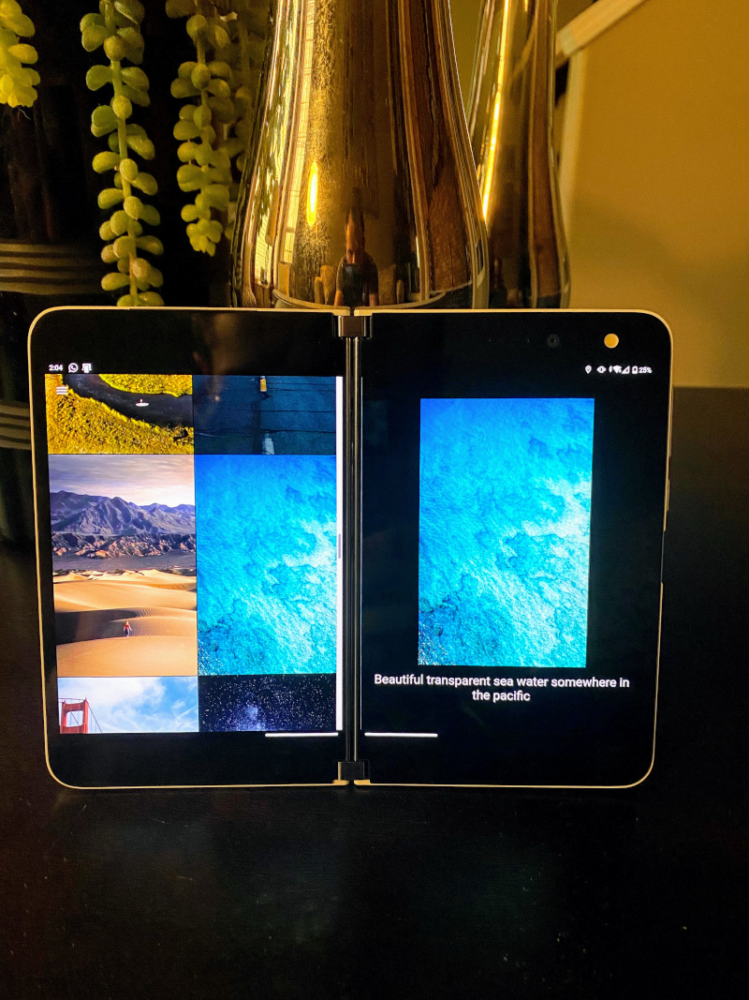
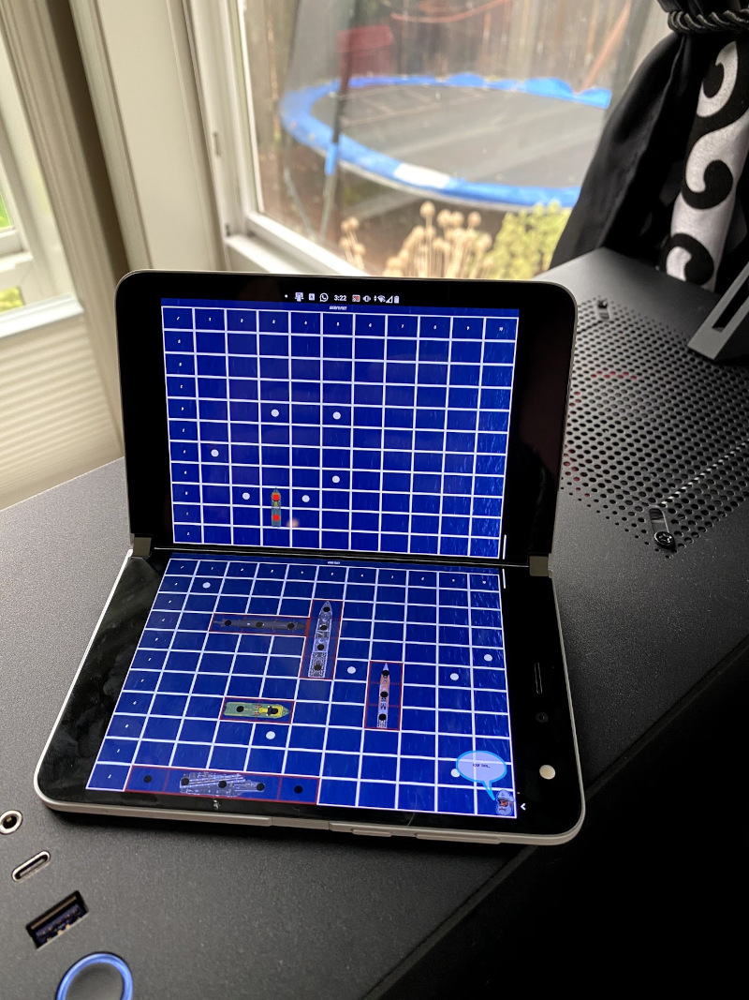
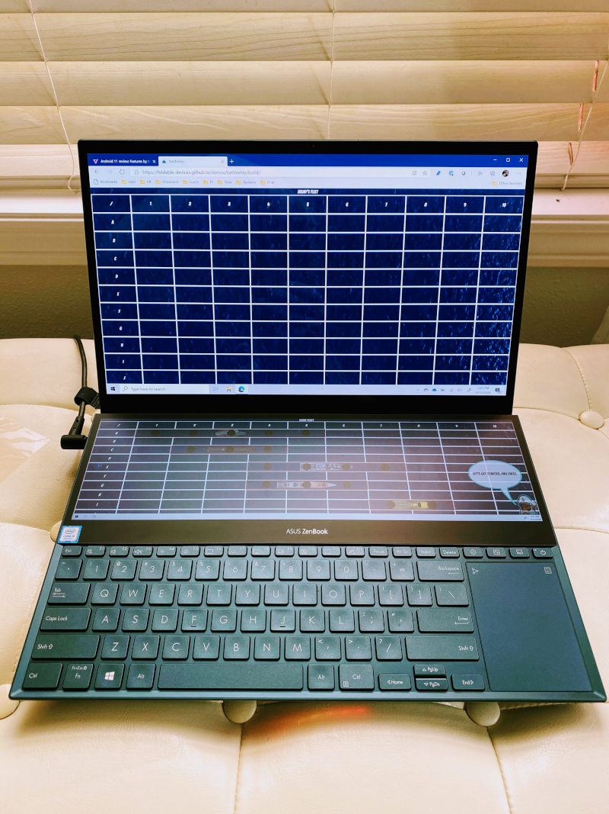
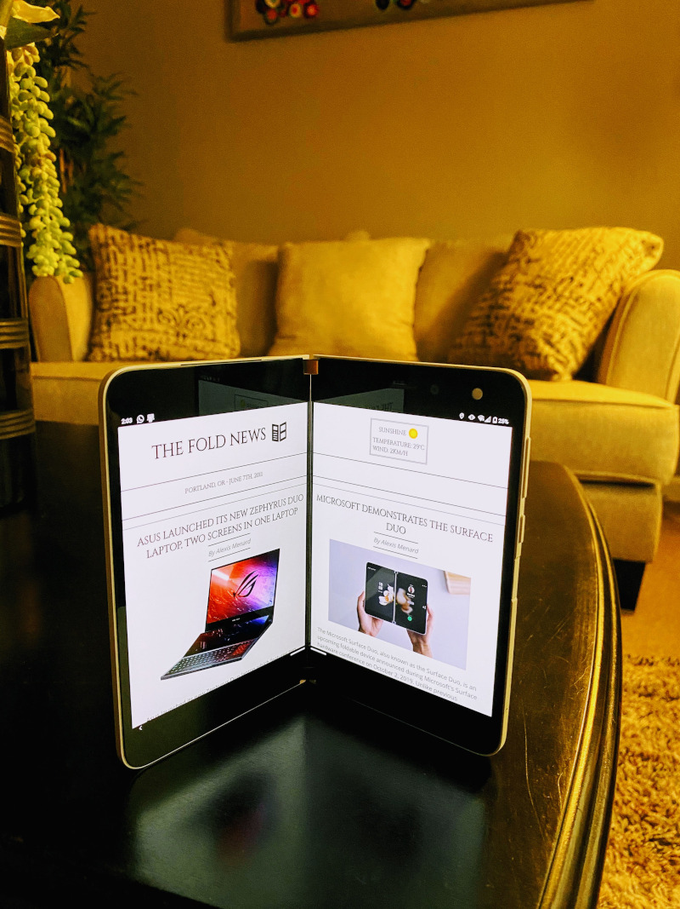
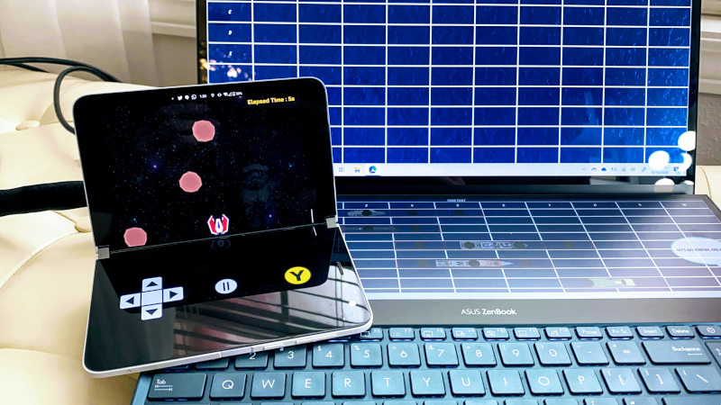

# A set of demos to showcase support of foldable devices on the web.

Links :
- Photo Gallery: Navigate [here](https://foldable-devices.github.io/demos/photo-gallery).

&nbsp;

- Battleship: Navigate [here](https://foldable-devices.github.io/demos/battleship).

&nbsp;

- FoldNews: Navigate [here](https://foldable-devices.github.io/demos/foldnews).

&nbsp;

- StarFold: Navigate [here](https://foldable-devices.github.io/demos/starfold).

&nbsp;

# How to build/develop the demos
Enter a directory and run follow the README.md.